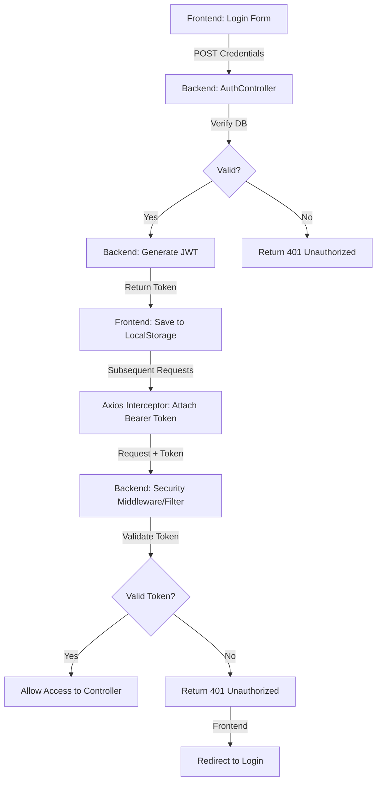

# TirthSeva: Detailed Session Management Flow

This document provides a deep dive into how sessions and authentication are managed across the TirthSeva ecosystem using **Stateless JWT**.

---

## 1. Authentication Lifecycle

The session flow follows a strict **Login -> Issue -> Store -> Intercept -> Verify** cycle.

### Step 1: User Login
The user submits their credentials (Email/Password) to the `/api/auth/login` endpoint.

#### .NET Implementation
In [AuthController.cs](file:///c:/Users/virag/Desktop/AMEYDROP/working_tirthseva/backend/TirthSeva.API/Controllers/AuthController.cs), the `Login` method delegates authentication to the `AuthService`.
```csharp
// AuthController.cs : Line 38
[HttpPost("login")]
public async Task<ActionResult<LoginResponse>> Login([FromBody] LoginRequest request)
{
    var result = await _authService.LoginAsync(request); // Verifies hash & generates token
    if (result == null) return Unauthorized(new { message = "Invalid email or password" });
    return Ok(result);
}
```

#### Spring Boot Implementation
In [AuthController.java](file:///c:/Users/virag/Desktop/AMEYDROP/working_tirthseva/backend-spring/src/main/java/com/tirthseva/api/controller/AuthController.java), the `login` method handles the request.
```java
// AuthController.java : Line 40
@PostMapping("/login")
public ResponseEntity<?> login(@Valid @RequestBody LoginRequest request) {
    LoginResponse result = authService.login(request);
    if (result == null) return ResponseEntity.status(401).body(Map.of("message", "Invalid email or password"));
    return ResponseEntity.ok(result);
}
```

---

### Step 2: JWT Generation
Once credentials are valid, the backend generates a JWT containing user claims (ID, Email, Role).

#### .NET (`JwtHelper.cs`)
The `GenerateToken` method creates a signed string using a secret key.
```csharp
// JwtHelper.cs : Line 17
public string GenerateToken(int userId, string email, string role) {
    var claims = new[] {
        new Claim(JwtRegisteredClaimNames.Sub, userId.ToString()),
        new Claim(JwtRegisteredClaimNames.Email, email),
        new Claim(ClaimTypes.Role, role),
        new Claim(JwtRegisteredClaimNames.Jti, Guid.NewGuid().ToString())
    };
    // ... signing logic with SymmetricSecurityKey ...
}
```

#### Spring Boot (`JwtUtil.java`)
Uses the `io.jsonwebtoken` library to build the token.
```java
// JwtUtil.java : Line 31
public String generateToken(Integer userId, String email, String role) {
    return Jwts.builder()
            .subject(userId.toString())
            .claim("email", email)
            .claim("role", role)
            .expiration(expiryDate)
            .signWith(getSigningKey())
            .compact();
}
```

---

### Step 3: Frontend Storage & Persistence
The React frontend receives the token and stores it in `localStorage` for persistence.

#### `authService.js`
```javascript
// authService.js : Line 10
login: async (data) => {
    const response = await api.post('/auth/login', data);
    if (response.data.token) {
        localStorage.setItem('token', response.data.token); // Store token
        localStorage.setItem('user', JSON.stringify(response.data)); // Store metadata
    }
    return response.data;
}
```

---

### Step 4: Outgoing Request Interception
Every subsequent API call automatically includes the token.

#### `api.js` (Axios Interceptor)
The request interceptor pulls the token from storage and adds it to the `Authorization` header. It also prevents sending requests if the token is already expired.
```javascript
// api.js : Line 22
api.interceptors.request.use((config) => {
    const token = localStorage.getItem('token');
    if (token) {
        if (isTokenExpired(token)) {
            localStorage.removeItem('token');
            window.location.href = '/login';
            return Promise.reject(new Error('Token expired'));
        }
        config.headers.Authorization = `Bearer ${token}`; // ATTACH TOKEN
    }
    return config;
});
```

---

### Step 5: Backend Token Verification
For protected routes, the backend verifies the token's validity and identity.

#### Spring Boot (`JwtAuthFilter.java`)
A custom filter runs before every request to populate the security context.
```java
// JwtAuthFilter.java : Line 28
protected void doFilterInternal(...) {
    String authHeader = request.getHeader("Authorization");
    if (authHeader != null && authHeader.startsWith("Bearer ")) {
        String token = authHeader.substring(7);
        if (jwtUtil.validateToken(token)) {
            // Extract details and set SecurityContext
            SecurityContextHolder.getContext().setAuthentication(authentication);
        }
    }
    filterChain.doFilter(request, response);
}
```

#### .NET Middleware (`Program.cs`)
Standard middleware handles the extraction and validation automatically as configured.
```csharp
// Program.cs : Line 31
.AddJwtBearer(options => {
    options.TokenValidationParameters = new TokenValidationParameters {
        ValidateIssuerSigningKey = true,
        IssuerSigningKey = new SymmetricSecurityKey(Encoding.UTF8.GetBytes(secret)),
        ValidateLifetime = true,
        // ...
    };
});
```

---

## 2. Summary Table

| Action | Component | File Reference |
| :--- | :--- | :--- |
| **Login Entry** | Controller | [AuthController.cs](file:///c:/Users/virag/Desktop/AMEYDROP/working_tirthseva/backend/TirthSeva.API/Controllers/AuthController.cs) / [AuthController.java](file:///c:/Users/virag/Desktop/AMEYDROP/working_tirthseva/backend-spring/src/main/java/com/tirthseva/api/controller/AuthController.java) |
| **Password Hash** | Service | `BCrypt.Net.BCrypt.Verify` / `BCryptPasswordEncoder` |
| **Token Creation** | Helper/Util | [JwtHelper.cs](file:///c:/Users/virag/Desktop/AMEYDROP/working_tirthseva/backend/TirthSeva.API/Helpers/JwtHelper.cs) / [JwtUtil.java](file:///c:/Users/virag/Desktop/AMEYDROP/working_tirthseva/backend-spring/src/main/java/com/tirthseva/api/security/JwtUtil.java) |
| **Client Storage** | Browser | `localStorage.setItem('token', ...)` |
| **Auto-Attach** | Axios Interceptor | [api.js](file:///c:/Users/virag/Desktop/AMEYDROP/working_tirthseva/frontend/src/services/api.js) |
| **Auth Filter** | Middleware/Filter | [JwtAuthFilter.java](file:///c:/Users/virag/Desktop/AMEYDROP/working_tirthseva/backend-spring/src/main/java/com/tirthseva/api/security/JwtAuthFilter.java) / `app.UseAuthentication()` |

---

## 3. High-Level Diagram


